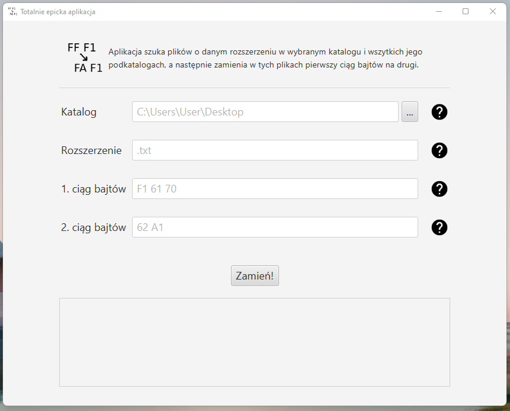
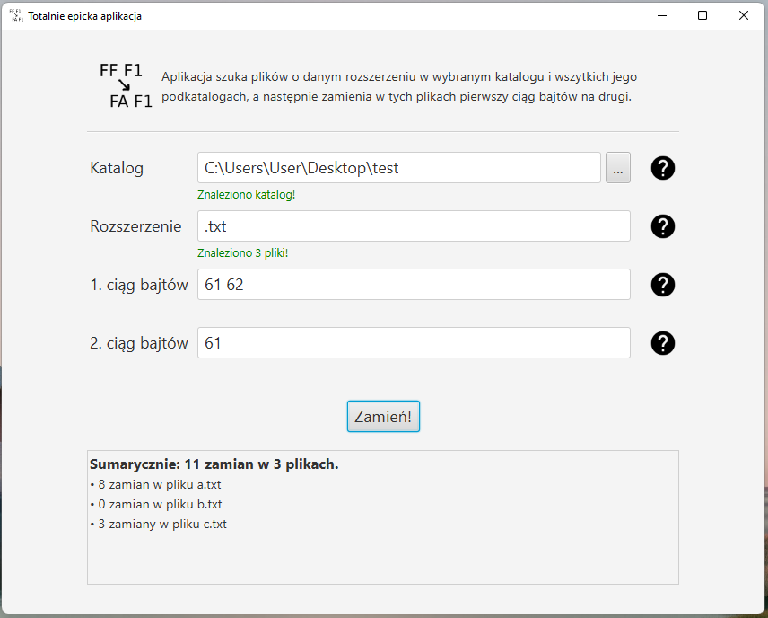
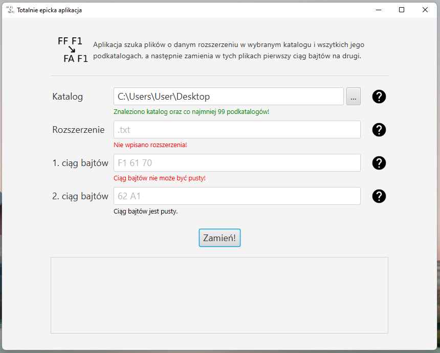

# totally-epic-app

QBS recruitment task

## Task

Find all files with specified extension in chosen directory and all its subdirectories. In those files search for first byte sequence and replace it with second one.

## Screenshots

## Running
There is executable [jar file](out/artifacts/totally_epic_app_jar/totally-epic-app.jar). It *should* work with Java 16+.